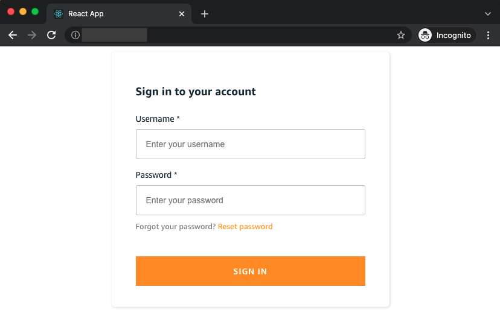
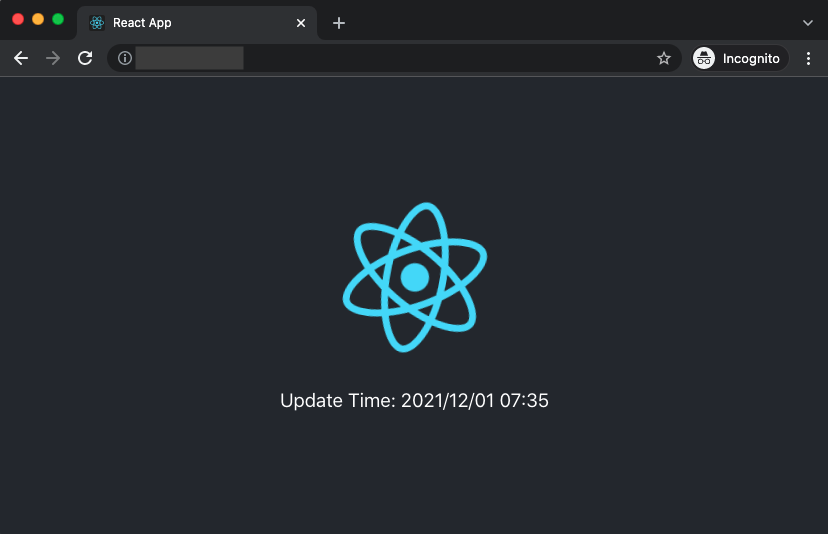
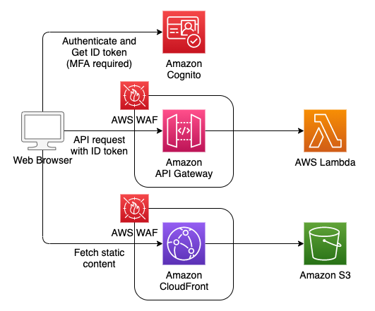

# React SPA App with Serverless Backend and Congito Auth Demo

## Overview

This sample shows how to make a SPA application with serverless backend by AWS Cloud Development Kit (CDK). You can also see from this sample how to control access to API with Amazon Cognito and attach WAF to API Gateway and CloudFront.

Screenshots of this demo are shown below.




## Architecture

There are three cdk stacks, which correspond to each row in the architecure below.

- AuthStack
  - Amazon Cognito
- APIStack
  - Amazon API Gateway, AWS WAF, AWS Lambda
- FrontendStack
  - Amazon CloudFront, AWS WAF, Amazon S3



## Directory Structures

```sh
.
├── backend          # CDK scripts for backend resources
└── frontend
    ├── provisioning # CDK scripts for frontend resources
    └── web          # React scripts
```

## Main Libraries

- @aws-amplify/ui-components
- @aws-amplify/ui-react
- aws-amplify
- aws-cdk
- aws-lambda
- jest
- react
- react-scripts
- ts-node
- typescript

## Prerequisites

- npm
- cdk
- configuration of aws profile

## Getting started

### 1. Clone the repository

- Run `git clone` command to download the source code

### 2. Deploy backend resources

- Run `npm install` command in the [backend](backend) directory.
- Run `cdk deploy --all` to deploy backend resouces.
  - You can deploy each stack individually like `cdk deploy AuthStack`.
- When resouces are successfully deployed, outputs such as APIStack.CognitoUserPoolId will be shown in the terminal. These values will be used to deploy frontend resouces.

```sh
Outputs:
APIStack.CognitoUserPoolId = xxx
APIStack.CognitoUserPoolWebClientId = xxx
APIStack.ExportsOutputFnGetAttUserPoolxxx = xxx
...
Outputs:
AuthStack.apiEndpointxxx = xxx
```

### 3. Deploy frontend resources

#### 3.1 Build React app

- Run `npm install` command in the [frontend/web](frontend/web) directory.
- Update `frontend/web/src/App.tsx` to use the previous outputs.
  - userPoolId
  - userPoolWebClientId
  - apiEndpoint
- Run `npm run build` in the same directory to build react scripts.

#### 3.2 Deploy frontend resources

- Move to [frontend/provisioning](frontend/provisioning) directory and run `npm install` command.
- Run `cdk deploy --all` to deploy frontend resouces.
- When resouces are successfully deployed, FrontendStack.endpoint will be displayed in the terminal. You will access the app hosted on cloudfront/s3 by this url.

```sh
Outputs:
FrontendStack.endpoint = xxx.cloudfront.net
```

### 4. Create Cognito user

- In order to sign in the app, you need to create a new cognito user. You can create a user by AWS Management Console or AWS CLI.

## Security

See [CONTRIBUTING](CONTRIBUTING.md#security-issue-notifications) for more information.

## License

This library is licensed under the MIT-0 License. See the LICENSE file.
